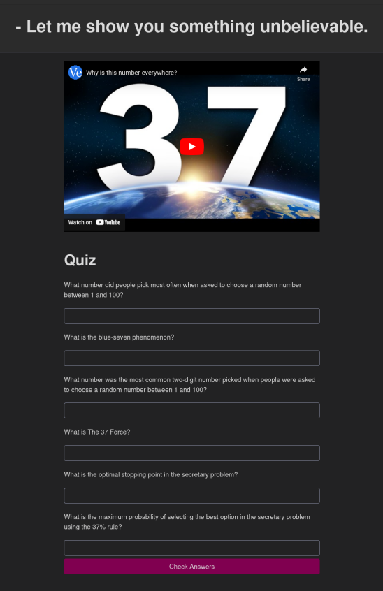

# YouTube Quiz

## Description

Struggle to remember the YouTube videos you watched? Take a quiz after watching
to help you!

How?

1. Watch YouTube video
2. Paste URL into app
3. Answer the generated questions
4. Get your results!

## Screenshots

## Installation

1. Run `docker run -it --rm -p 3000:3000 ghcr.io/lucaelin/youtube-quiz:main`
2. Open `http://localhost:3000` in your browser.
3. Login to OpenRouter
4. Start Quizzing!
